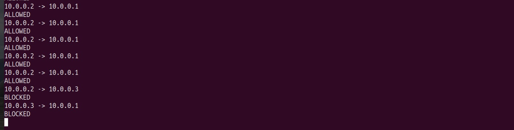
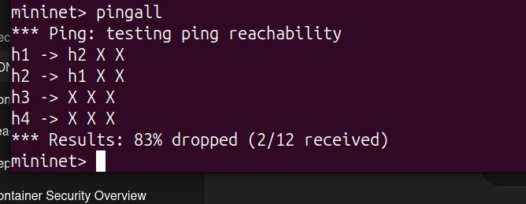
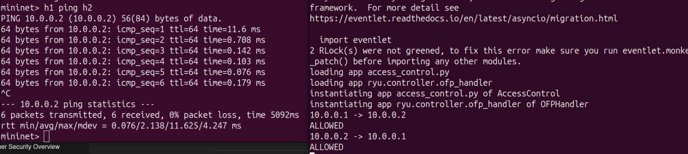
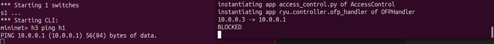
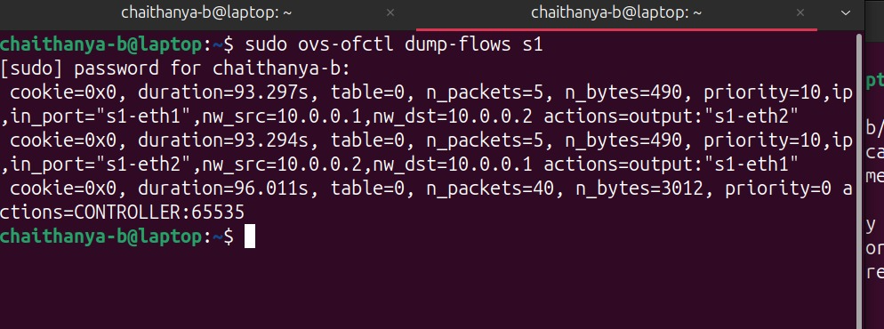
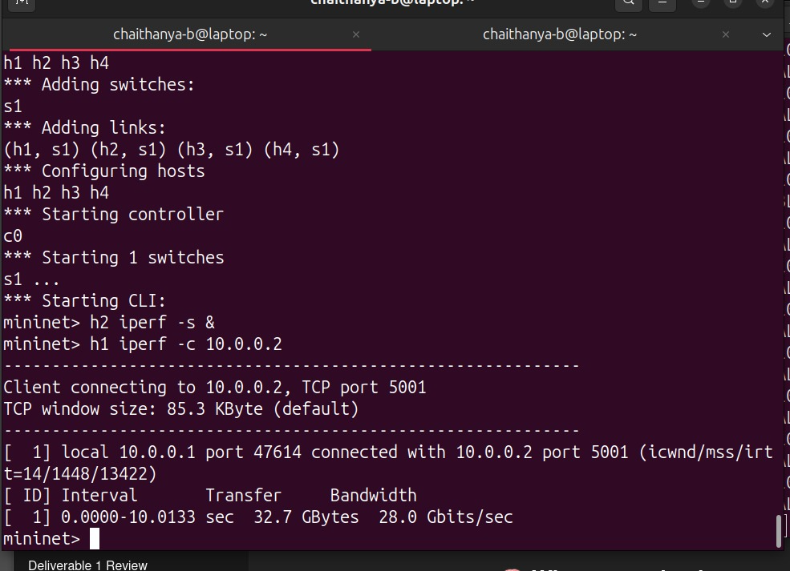

# SDN-Based Access Control using Ryu + Mininet

**Course:** COMPUTER NETWORKS – UE24CS252B  
**Assignment:** SDN Mininet-based Simulation  
**Controller:** Ryu (OpenFlow 1.3)

---

## Problem Statement

In a standard network, any host can communicate with any other host freely. This project implements a centralized **whitelist-based access control** mechanism using an SDN controller. Only explicitly authorized host pairs are permitted to communicate — all other traffic is silently dropped at the switch level.

---

## Topology

```
h1 (10.0.0.1) ─┐
h2 (10.0.0.2) ─┤
                s1 ──── Ryu Controller (remote)
h3 (10.0.0.3) ─┤
h4 (10.0.0.4) ─┘
```

- 1 switch (Open vSwitch), 4 hosts, 1 remote Ryu controller  
- All hosts connected to a single switch (single-tier topology)

---

## Access Policy (Whitelist)

| Source Host | Allowed Destinations | Action |
|-------------|----------------------|--------|
| h1 (10.0.0.1) | h2 (10.0.0.2) | ALLOW |
| h2 (10.0.0.2) | h1 (10.0.0.1) | ALLOW |
| h3 (10.0.0.3) | *(none)* | BLOCK all |
| h4 (10.0.0.4) | *(none defined)* | BLOCK all |

The whitelist is defined directly in `access_control.py` and can be modified to add or remove authorized communication pairs.

---

## Project Structure

```
SDN-Access-Control/
├── access_control.py     # Ryu controller — whitelist-based access control
└── screensots/           # Proof-of-execution screenshots
    ├── Ryu_output.png
    ├── pingall.png
    ├── allowed_ping.png
    ├── blocked_ping.png
    ├── flow_table.png
    └── iperf.png
```

---

## How It Works

### Default Table-Miss Rule
On switch connect, a low-priority (priority 0) table-miss rule is installed to send all unmatched packets to the controller via `packet_in`.

### MAC Learning
As packets arrive, the controller learns the `source MAC → ingress port` mapping, enabling unicast forwarding without flooding.

### Access Control Logic (on IP packets)
When an IP packet triggers a `packet_in` event:

1. The controller extracts the **source IP** and **destination IP**.
2. It checks the **whitelist** to see if the source is allowed to reach the destination.
3. **If ALLOWED** → a forwarding flow rule is installed at **priority 10**.
4. **If BLOCKED** → a drop rule (empty action list) is installed at **priority 10**, and the packet is discarded immediately.

Non-IP packets (ARP, multicast, etc.) bypass the access control check and are forwarded normally to maintain basic network functionality.

### Flow Rule Priority

```
Priority 10  →  ALLOW / DROP rules  (access control, installed reactively)
Priority 0   →  Table-miss          (send to controller)
```

---

## Setup & Prerequisites

```bash
# Install Mininet
sudo apt install mininet -y

# Install Ryu
pip install ryu

# Install iperf
sudo apt install iperf -y
```

---

## Running the Project

### Terminal 1 — Start the Ryu Controller

```bash
cd ~/ryu
PYTHONPATH=. python3 ryu/cmd/manager.py access_control.py
```

Wait until you see the controller ready message before starting Mininet.

### Terminal 2 — Start Mininet

```bash
sudo mn -c                                     # Clean up any previous state
sudo mn --topo single,4 --controller remote
```

---

## Test Cases

### Allowed Communication — h1 ↔ h2

```
mininet> h1 ping h2
```

**Expected:** Successful ping — packets forwarded and ALLOW rule installed in flow table.

---

### Blocked Communication — h3 → h1

```
mininet> h3 ping h1
```

**Expected:** 100% packet loss — DROP rule installed, no packets forwarded.

---

### Network-wide Reachability Test

```
mininet> pingall
```

**Expected output:**
- h1 ↔ h2 → reachable
- All other host pairs → unreachable

This confirms that the whitelist policy is correctly enforced across the entire network.

---

## Performance Check

```
mininet> h2 iperf -s &
mininet> h1 iperf -c 10.0.0.2
```

**Observation:** High throughput is achieved on the allowed h1 → h2 path, since Mininet runs in a virtualized environment with minimal overhead. This confirms that permitted flows are forwarded efficiently after the initial flow rule is installed.

---
## Screenshots

Controller console showing ALLOWED / BLOCKED log messages  


Mininet `pingall` confirming only h1 ↔ h2 succeed  


Successful ping between h1 and h2  


Failed ping from h3 (all packets dropped)  


OVS flow table showing installed ALLOW and DROP rules  


iperf throughput result for the allowed h1 → h2 path  

---

## Key Observations

- The Ryu controller correctly handles `packet_in` events and installs flow rules reactively.
- Once a flow rule is installed, subsequent packets on that flow are handled entirely at the switch — the controller is not involved again.
- Unauthorized traffic is dropped immediately after the first packet triggers the DROP rule installation.
- ARP and other non-IP background traffic do not interfere with access control results.
- Modifying the whitelist and restarting the controller applies new policies cleanly.

---

## Conclusion

This project demonstrates how SDN enables centralized, programmable traffic control. By leveraging a Ryu controller and OpenFlow 1.3, network access policies can be defined as a simple whitelist and enforced dynamically across all switches — without requiring any per-device configuration. The approach is flexible, scalable, and easy to audit.

---

## References

1. Ryu SDN Framework – https://ryu-sdn.org/
2. Ryu Documentation – https://ryu.readthedocs.io/en/latest/
3. Mininet Overview – https://mininet.org/overview/
4. Mininet Walkthrough – https://mininet.org/walkthrough/
5. OpenFlow 1.3 Specification – https://opennetworking.org/wp-content/uploads/2014/10/openflow-spec-v1.3.0.pdf
6. Open vSwitch – https://www.openvswitch.org/
